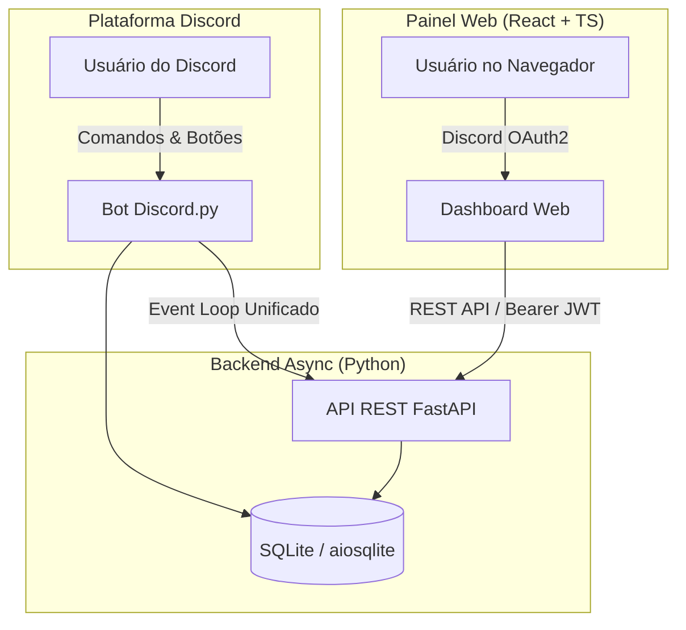

# 🏠 BRP Houses — Sistema de Economia, Baús e Painel Web para Discord

<div align="center">


</div>

---

## 📌 Sobre o Projeto

O **BRP Houses** é uma solução **Full-Stack** completa desenvolvida para gestão financeira, controle de baús de itens compartilhados e administração avançada de comunidades de Discord (focado em servidores de Roleplay / GTA RP e clãs).

O projeto integra um **Bot de Discord em Python** (utilizando componentes interativos como botões e seletores) a uma **API RESTful Assíncrona em FastAPI**, conectada a um **Painel Web moderno e responsivo em React com TypeScript**.

---

## ✨ Funcionalidades Principais

### 🤖 Bot de Discord (`bot.py`)
- 💰 **Sistema de Banco & Saldo**: Transações financeiras com histórico detalhado por usuário.
- 📦 **Gerenciamento de Baús/Casas**: Sistema de inventário por imóvel com permissões para donos e convidados.
- 🤝 **Contabilidade Automática de Débitos**: Registro e abatimento inteligente de itens emprestados/retirados entre membros de uma mesma casa.
- 🎛️ **Views Interativas**: Menus de controle dinâmicos diretamente no chat do Discord com atualização em tempo real.

### 🌐 Painel Web / Dashboard (`frontend/`)
- 🔑 **Autenticação Discord OAuth2 & JWT**: Login seguro com controle de sessão e tokens JWT de alta segurança.
- 📊 **Dashboard Consolidado**: Visão geral do saldo, total de itens em estoque, dívidas pendentes e linha do tempo de atividades recentes.
- 🏦 **Extrato Financeiro com Filtros**: Pesquisa de transações por texto e filtro rápido por tipo (Depósitos/Saques).
- 🧰 **Gestão de Baús e Saques Direcionados**: Escolha entre saques cooperativos ou saques com dívida associada, além de opção de desassociação ("Sair da casa").
- 🛡️ **Painel Administrativo de Governança (Staff-Only)**:
  - Ocultação automática de atalhos para usuários comuns via verificação dinâmica de cargos.
  - Central de **Logs Globais do Servidor** com busca livre e limpeza automática de tags do Discord.
  - Configuração de canais do bot (edição, saques, logs) e cargo de Staff via web.
  - Ferramentas administrativas para injeção de itens em baús e perdoamento/limpeza de dívidas.

---

## 🛠️ Arquitetura do Sistema



---

## 🚀 Tecnologias Utilizadas

### **Backend & Bot**
- **Linguagem**: Python 3.10+
- **Framework Web**: FastAPI (Arquitetura modularizada via `APIRouter`)
- **Bot Framework**: `discord.py` (v2.x) com suporte a Cogs e Views persistentes
- **Servidor ASGI**: Uvicorn (rodando concorrentemente no loop assíncrono)
- **Banco de Dados**: SQLite3 Assíncrono com `aiosqlite`
- **Autenticação**: PyJWT e validação remota de membros da guilda

### **Frontend**
- **Framework**: React 19 + Vite
- **Linguagem**: TypeScript
- **Estilização**: Tailwind CSS v4
- **Animações & Micro-interações**: Framer Motion
- **Ícones**: Lucide React
- **Navegação & Notificações**: React Router v7 & React Hot Toast

---

## 📁 Estrutura do Repositório

```text
├── api.py                    # Inicialização e middlewares da aplicação FastAPI
├── bot.py                    # Entry-point do Bot do Discord e servidor Web uvicorn
├── config.py                 # Funções utilitárias e ajudantes de formatação
├── database.py               # Camada de dados e consultas SQL assíncronas
├── views.py                  # Componentes de UI nativos do Discord (Buttons/Selects)
├── .env.example              # Modelo de variáveis de ambiente
├── .gitignore                # Regras de exclusão do repositório
│
├── api_routes/               # Módulos de Rotas da API REST
│   ├── dependencies.py       # Injeção de dependências e validação JWT/Guild
│   └── routers/              # Endpoints divididos por contexto (admin, auth, bank, chests)
│
├── cogs/                     # Módulos estendidos do Bot Discord (Commands/Events)
│   ├── admin.py
│   ├── bank.py
│   └── chests.py
│
└── frontend/                 # Aplicação Web React + TypeScript
    ├── src/
    │   ├── api.ts            # Cliente HTTP Axios centralizado
    │   ├── components/       # Componentes de Layout e Modais
    │   └── pages/            # Telas da aplicação (Home, Bank, Chests, Admin, Login)
    ├── package.json
    └── vite.config.ts
```

---

## ⚙️ Instruções de Instalação e Execução Local

### **Pré-requisitos**
- **Python**: v3.10 ou superior
- **Node.js**: v18.x ou superior (com `npm` ou `yarn`)
- **Aplicação no Discord Developer Portal** (com escopos `bot` e `identify`/`guilds` ativados)

---

### 1️⃣ Configuração do Backend (Bot + API)

1. **Clone o repositório:**
   ```bash
   git clone https://github.com/1GabsFps/brp-houses.git
   cd brp-houses
   ```

2. **Crie e ative um ambiente virtual Python:**
   ```bash
   # Windows
   python -m venv venv
   .\venv\Scripts\activate

   # Linux/macOS
   python3 -m venv venv
   source venv/bin/activate
   ```

3. **Instale as dependências Python:**
   ```bash
   pip install discord.py fastapi uvicorn aiosqlite pyjwt pydantic python-dotenv requests
   ```

4. **Configure as Variáveis de Ambiente (`.env`):**
   Crie um arquivo `.env` na raiz do projeto com base no modelo `.env.example`:
   ```env
   DISCORD_TOKEN=seu_bot_token_aqui
   DISCORD_CLIENT_ID=seu_client_id_aqui
   DISCORD_CLIENT_SECRET=seu_client_secret_aqui
   DISCORD_REDIRECT_URI=http://localhost:5173/callback
   JWT_SECRET=seu_secret_jwt_seguro_aqui
   ENVIRONMENT=development
   ```

5. **Inicie o servidor Backend + Bot:**
   ```bash
   python bot.py
   ```
   > ℹ️ O backend estará disponível em `http://localhost:8000`.

---

### 2️⃣ Configuração do Frontend (Painel Web)

1. **Navegue até a pasta do frontend:**
   ```bash
   cd frontend
   ```

2. **Instale as dependências Node:**
   ```bash
   npm install
   ```

3. **Inicie o servidor de desenvolvimento:**
   ```bash
   npm run dev
   ```
   > 🌐 O painel web estará rodando em `http://localhost:5173`.

---

## 🛡️ Segurança da Informação

> [!IMPORTANT]
> NUNCA envie para repositórios públicos arquivos como `.env`, bancos de dados reais (`bot.db`), senhas ou chaves privadas SSH. Certifique-se de manter o arquivo `.gitignore` configurado.

---

## 📄 Licença

Este projeto está sob a licença [MIT](./LICENSE). Veja o arquivo de licença para mais detalhes.

---

<div align="center">
Desenvolvido para portfólio de engenharia de software full-stack.
</div>
